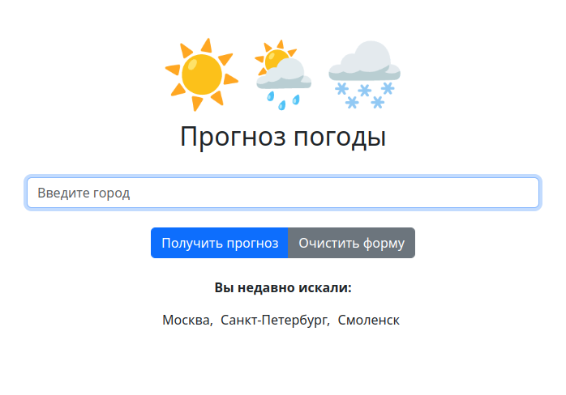

# Simple weather forecast

### Прогноз погоды

## Описание
**Тестовое задание на позицию Junior Python Developer.**

**Демо:** https://forecast.trsv-dev.ru/

## Задание:

Сделать web приложение, оно же сайт, где пользователь вводит название города, 
и получает прогноз погоды в этом городе на ближайшее время.

 - Вывод данных (прогноза погоды) должен быть в удобно читаемом формате.
 - Веб фреймворк можно использовать любой.
 - api для погоды: https://open-meteo.com/ (можно использовать какое-нибудь другое, 
если вам удобнее)

Будет плюсом если:

- написаны тесты,
- всё это помещено в docker контейнер,
- сделаны автодополнение (подсказки) при вводе города,
- при повторном посещении сайта будет предложено посмотреть погоду в городе, 
в котором пользователь уже смотрел ранее,

- ~~будет сохраняться история поиска для каждого пользователя, и будет API, показывающее сколько раз вводили какой город~~

## Что сделано:

- Прогноз погоды в выбранном городе на текущий момент, на 10 ближайших часов и
на 10 ближайших дней.
- Написаны тесты, поверяющие основные точки отказа.
- Реализовано автодополнение вводимого пользователем города. Города России 
вводятся и дополняются на русском языке, города мира вводятся и дополняются на 
английском языке. Если вводить зарубежный город на русском - автодополнение 
не сработает, но прогноз будет получен.
- При повторном посещении сайта пользователю будет предложен список городов,
в которых он уже просматривал прогноз. Список хранится в сессии пользователя и 
отдается последние 20 (по умолчанию) городов. При нажатии на город он автоматически
подставляется в поле поиска.
- База данных не используется, все данные хранятся либо в сессии, либо получаются
посредством обращения к API.

## Что НЕ сделано:
- API, показывающее сколько раз вводили тот или иной город. История 
поиска каждого пользователя сохраняется настолько, насколько позволяет время
жизни сессии.

## Стек технологий:
* Python==3.12
* Django==4.2.14
* pytest-django==4.8.0
* poetry==1.8.3

## Запуск проекта

<details>

<summary>Инструкция по запуску в режиме локальной разработки</summary>

### **_Запуск из консоли._**

(Подразумевается, что **Poetry** уже установлен в системе)

Клонируйте репозиторий с **develop веткой** к себе на машину:
```
git@github.com:trsv-dev/simple_weather_forecast.git
```
Перейдите в папку проекта:
```
cd simple_weather_forecast/backend/
```
Установите зависимости:
```
poetry install --no-root
```
Переименуйте **.env.example** в **.env**, ознакомьтесь с содержимым, внесите
необходимые изменения.

Активируйте виртуальное окружение:
```
poetry shell
``` 
Создайте и примените миграции БД:
```
python manage.py makemigrations
python manage.py migrate
```
Создайте суперпользователя:
```
python manage.py createsuperuser
```
Запустите локальный сервер разработки:
```
python manage.py runserver 127.0.0.1:8000
```
Сайт будет доступен по адресу http://127.0.0.1:8000/,
админка будет доступна по адресу http://127.0.0.1:8000/admin/.

Запуск тестов - из директории backend с активированным виртуальным
окружением выполнить `pytest`

</details>

<details>

<summary>Инструкция по запуску в Docker-контейнерах</summary>

### **_Запуск в контейнерах._**

Клонируйте репозиторий с **develop веткой** к себе на машину:
```
git@github.com:trsv-dev/simple_weather_forecast.git
```
Перейдите в папку проекта:
```
cd simple_weather_forecast/
```

Переименуйте **.env.example** в **.env**, ознакомьтесь с содержимым, внесите
необходимые изменения.

Запустите контейнер в фоновом режиме:
```
docker compose -f docker-compose.yml up -d
```
Выполните и примените миграции БД (выполнять последовательно):
```
docker compose -f docker-compose.yml exec backend python manage.py makemigrations
docker compose -f docker-compose.yml exec backend python manage.py migrate
```
Соберите и скопируйте статику (выполнять последовательно):
```
docker compose -f docker-compose.yml exec backend python manage.py collectstatic
docker compose -f docker-compose.yml exec backend cp -r /app/collected_static/. /app/static/
```
Создайте суперпользователя:
```
docker compose -f docker-compose.yml exec backend python manage.py createsuperuser
```
Сайт будет доступен по адресу http://127.0.0.1:8000/,
админка будет доступна по адресу http://127.0.0.1:8000/admin/.

</details>

