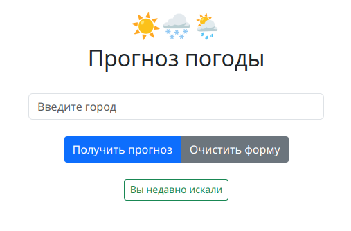
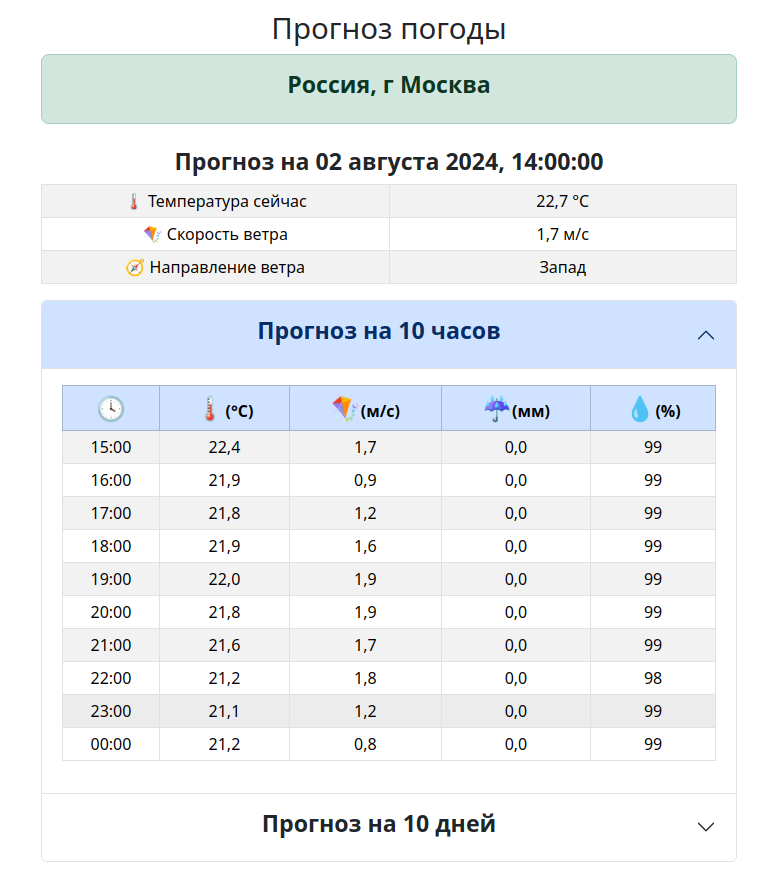

# Simple weather forecast

### Прогноз погоды


<details>

<summary>
    Другие изображения
</summary>

### Текущая погода


### Прогноз на 10 часов


### Прогноз на 10 дней


</details>

## Описание
Пэт-проект, целью которого является возможность попробовать в деле 
интересующие технологии, такие как Geopy, Dadada и Poetry.

**Демо:** https://forecast.trsv-dev.ru/

## Что реализовано:

- Прогноз погоды в выбранном городе на текущий момент, на 10 ближайших часов и
на 10 ближайших дней;
- Написаны тесты, поверяющие основные точки отказа;
- API для получения погоды https://open-meteo.com/;
- Реализовано автодополнение вводимого пользователем населенного пункта через Dadata.ru;
- Для геокодинга (получения координат населенного пункта) используется библиотека Geopy;
- При повторном посещении сайта пользователю будет предложен список населенных пунктов,
в которых он уже просматривал прогноз. Список хранится в сессии пользователя и 
отдается последние 10 (по умолчанию) городов. При нажатии на название населенного пункта 
он автоматически подставляется в поле поиска;
- База данных не используется, все данные хранятся либо в сессии, либо получаются
посредством обращения к API;
- Асинхронное обращение к Dadata.ru для автодополнения и сервису геокодинга 
Nominatim (через Geopy) с возможностью задать количество повторных попыток;
- Простая адаптивная Bootstrap верстка.

## Стек технологий:
* Python==3.12
* Django==4.2.14
* pytest-django==4.8.0
* poetry==1.8.3
* dadata==21.10.1
* geopy==2.4.1

## Запуск проекта

<details>

<summary>Инструкция по запуску в режиме локальной разработки</summary>

### **_Запуск из консоли._**

(Подразумевается, что **Poetry** уже установлен в системе)

Клонируйте репозиторий с **develop веткой** к себе на машину:
```
git@github.com:trsv-dev/simple_weather_forecast.git
```
Перейдите в папку проекта:
```
cd simple_weather_forecast/backend/
```
Установите зависимости:
```
poetry install --no-root
```
Переименуйте **.env.example** в **.env**, ознакомьтесь с содержимым, внесите
необходимые изменения.

Активируйте виртуальное окружение:
```
poetry shell
``` 
Создайте и примените миграции БД:
```
python manage.py makemigrations
python manage.py migrate
```
Создайте суперпользователя:
```
python manage.py createsuperuser
```
Запустите локальный сервер разработки:
```
python manage.py runserver 127.0.0.1:8000
```
Сайт будет доступен по адресу http://127.0.0.1:8000/,
админка будет доступна по адресу http://127.0.0.1:8000/admin/.

Запуск тестов - из директории backend с активированным виртуальным
окружением выполнить `pytest`

</details>

<details>

<summary>Инструкция по запуску в Docker-контейнерах</summary>

### **_Запуск в контейнерах._**

Клонируйте репозиторий с **develop веткой** к себе на машину:
```
git@github.com:trsv-dev/simple_weather_forecast.git
```
Перейдите в папку проекта:
```
cd simple_weather_forecast/
```

Переименуйте **.env.example** в **.env**, ознакомьтесь с содержимым, внесите
необходимые изменения.

Запустите контейнер в фоновом режиме:
```
docker compose -f docker-compose.yml up -d
```
Выполните и примените миграции БД (выполнять последовательно):
```
docker compose -f docker-compose.yml exec backend python manage.py makemigrations
docker compose -f docker-compose.yml exec backend python manage.py migrate
```
Соберите и скопируйте статику (выполнять последовательно):
```
docker compose -f docker-compose.yml exec backend python manage.py collectstatic
docker compose -f docker-compose.yml exec backend cp -r /app/collected_static/. /app/static/
```
Создайте суперпользователя:
```
docker compose -f docker-compose.yml exec backend python manage.py createsuperuser
```
Сайт будет доступен по адресу http://127.0.0.1:8000/,
админка будет доступна по адресу http://127.0.0.1:8000/admin/.

</details>

